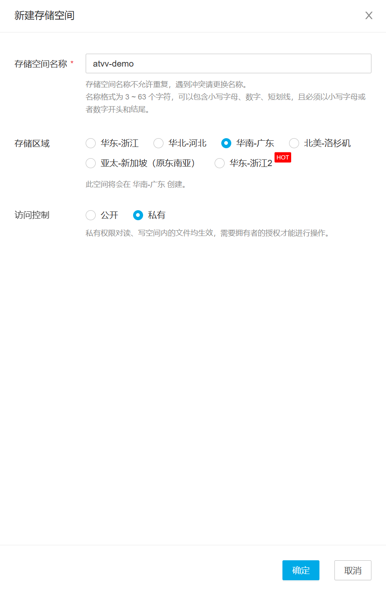
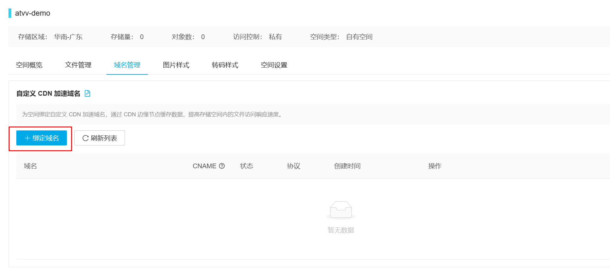
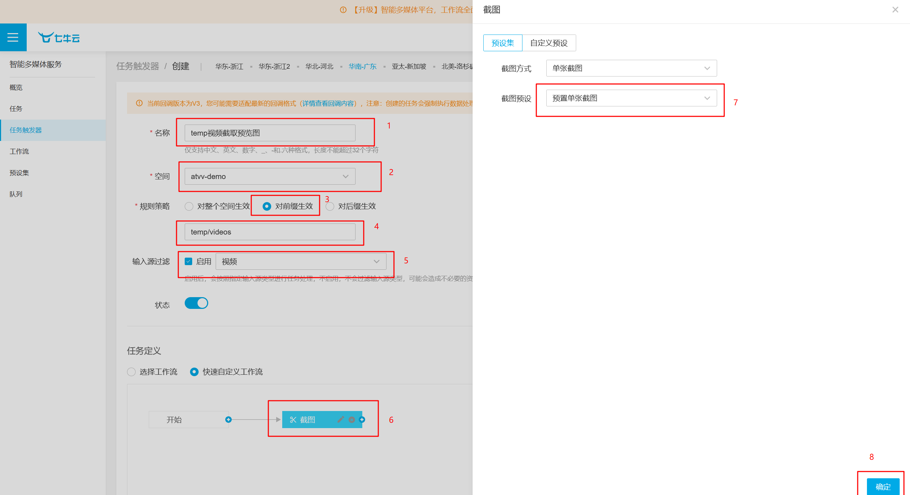
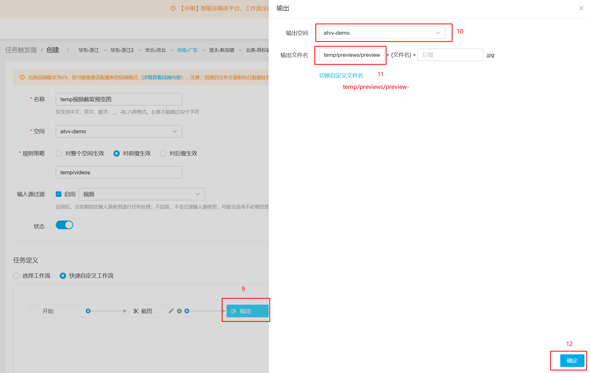
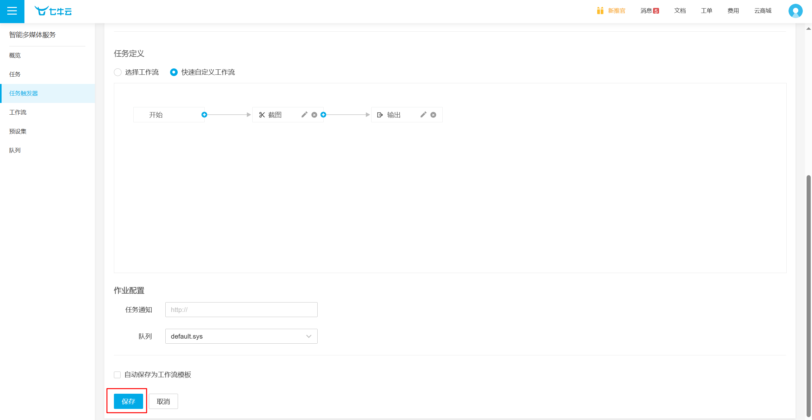
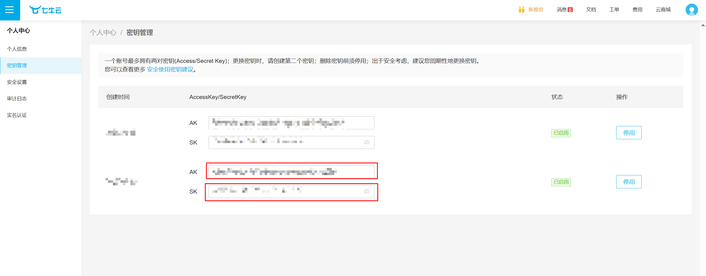

# atvv-imva-backend
Web端短视频应用后端仓库


## 后端技术选型

| 技术       | 说明            |
| ---------- | --------------- |
| SpringBoot | Web应用开发框架 |
| MyBatis    | ORM框架         |
| Redis      | 内存数据存储    |
| 七牛OSS    | 对象存储        |
| JWT        | JWT登录支持     |
| Lombok     | Java语言增强库  |
| Maven      | 依赖管理工具    |


## 部署环境

| 工具    | 版本号           |
| ------- | ---------------- |
| JDK     | 1.8              |
| MySQL   | 8.0.28           |
| Redis   | 7.2              |
| 七牛OSS | 官网创建私有空间 |


## 安装步骤

### 1. jar包

在 `Backend/imva` 目录下，执行 `mvn package` ，在 `Backend/imva/target` 目录下得到依赖项文件夹 `lib` 和 jar包 `imva-1.0.jar`，将其与配置文件 `Backend/imva/src/main/resources/application.yaml` 移动到同一个文件夹中。

### 2. mysql

docker安装mysql

```bash
docker run -d --restart=always --name mysql \
-v your_mysql_path/mysql/data:/var/lib/mysql \
-v your_mysql_path/mysql/conf:/etc/mysql \
-p 3306:3306 \
-e TZ=Asia/Shanghai \
-e MYSQL_ROOT_PASSWORD= your_mysql_password \
mysql:8.0.28 \
--lower-case-table-names=1 \
--character-set-server=utf8mb4 \
--collation-server=utf8mb4_general_ci 
```

### 3. redis

docker安装redis

```bash
docker run -d --restart=always --name redis \
--log-opt max-size=100m \
--log-opt max-file=2 \
-p 6379:6379 \
-v your_redis_path/redis/data:/data \
 redis:7.2   \
--requirepass your_redis_password
```

### 4. 七牛云oss

1. 登录七牛云账号

2. 新建私有空间



3. 绑定CDN域名(可选)，也可选择测试域名(30天有效期)



4. 创建智能多媒体工作流







5. 获取账号 AccessKey和SecretKey



6. 填写配置文件

```yaml
server:
  port: 9071

spring:
  application:
    name: atvv-imva
  datasource:
    url: jdbc:mysql://${MYSQL_HOST}:${MYSQL_PORT}/imva?useUnicode=true&characterEncoding=UTF-8&serverTimezone=Asia/Shanghai&useSSL=false&allowPublicKeyRetrieval=true&autoReconnect=true&allowMultiQueries=true
    username: ${MYSQL_USERNAME}
    password: ${MYSQL_PASSWORD}
    driver-class-name: com.mysql.cj.jdbc.Driver

  redis:
    host: ${REDIS_HOST}
    port: ${REDIS_PORT}
    password: ${REDIS_PASSWORD}
    database: 0
  servlet:
    multipart:
      max-file-size: 251658240

mybatis:
  mapper-locations: classpath*:mapper/*.xml
  configuration:
    map-underscore-to-camel-case: true

qiniu:
  accessKey: ${QINIU_ACCESSKEY}
  secretKey: ${QINIU_SECRETKEY}
  bucket: ${QINIU_BUCKET}
  cdnUrl: ${QINIU_CDNURL}
  regionUploadUrl: http://up-z2.qiniup.com #根据空间所在地区选择上传域名和是否使用https
secure:
  publicKey: 密码RSA加密公钥
  privateKey: 密码RSA加密密钥
```

7. 启动jar包

```bash
nohup java -jar -Dloader.path=./lib imva.jar >> imva.log 2>&1  &
```


