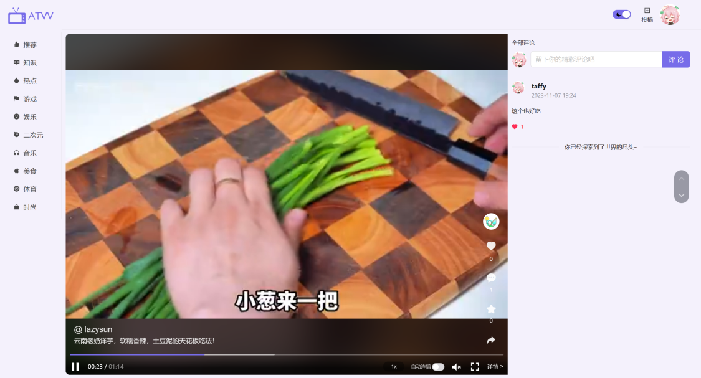
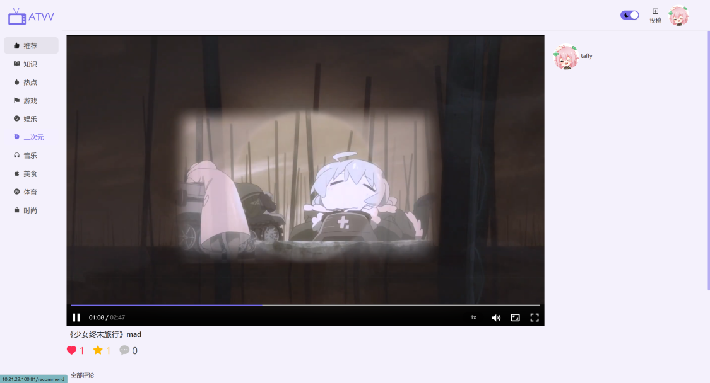
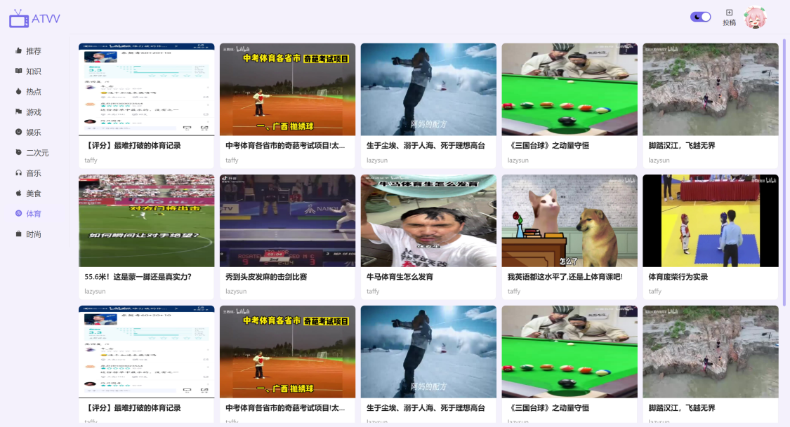
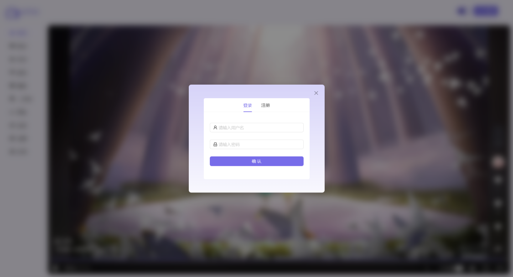
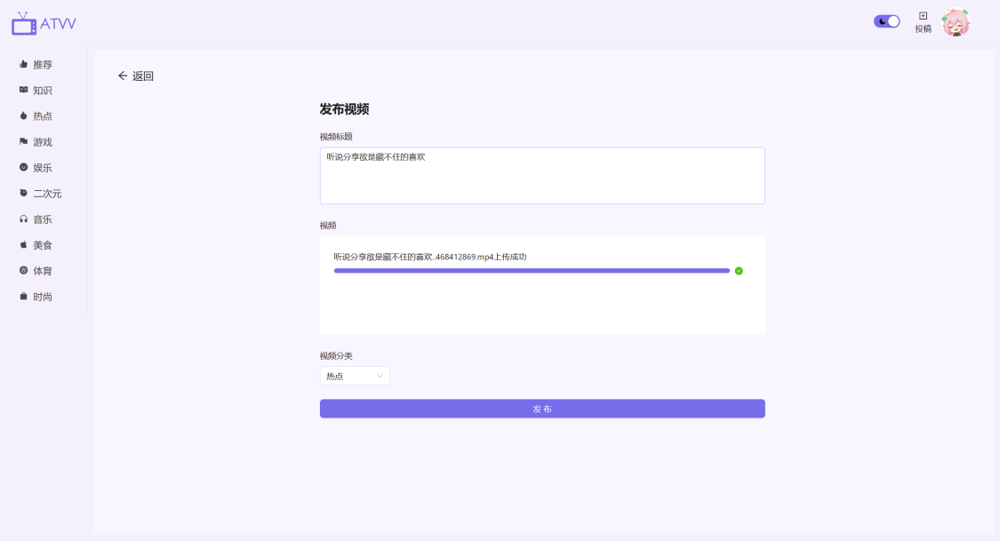

    

<h1 align="center">  atvv-imva  </h1>

## atvv-imva是什么

atvv-imva是一个于 [1024 创作节之校园编程马拉松 2023 - 七牛云](https://www.qiniu.com/activity/detail/651297ed0d50912d3d53307b?from=0005) 活动中诞生的项目，是一个类抖音的web端短视频平台，可提供给用户观看视频，上传水平，并进行交流互动。

## 前端部署

[Frontend/README.md](Frontend/README.md)

## 后端部署

[Backend/README.md](Backend/README.md)

## api文档

[API 文档](Backend/imva/src/main/resources/imva.html)

## 架构设计文档

[架构设计文档](doc/架构设计文档.md)

## 功能

### 1. 推荐页

- 可以点击右边按钮上下切换视频，或者鼠标点击上下拖拽切换视频
- 视频地址从接口请求（每次5条视频，由前端提前请求预加载）
- 视频播放器基于xgplayer二次封装，注入了自定义控制栏插件
- 使用账号在视频播放页面点赞、收藏视频
- 使用账号在视频播放页面添加评论，其他账号可点赞评论

### 2. 视频详情页

- 可以点赞，收藏视频
- 使用账号在视频播放页面下添加评论，点赞评论

### 3. 其他分类页

- 实现瀑布流无限加载效果（一次提供至多十个视频）
- 点击视频进入视频详情页

### 4. 登录注册

- 点击页面右上角按钮登录、注册
- 登录后可以退出登录

### 5. 上传视频

- 点击页面右上角【投稿】按钮进入上传视频页
- 填写表单上传视频后点击发布
- 视频上传支持分片上传与断点续传

## 演示示例

[演示视频](assets/演示视频.mp4)

在线演示视频：[演示视频.mp4](http://testqiniu.lazysun.me/演示视频.mp4)
