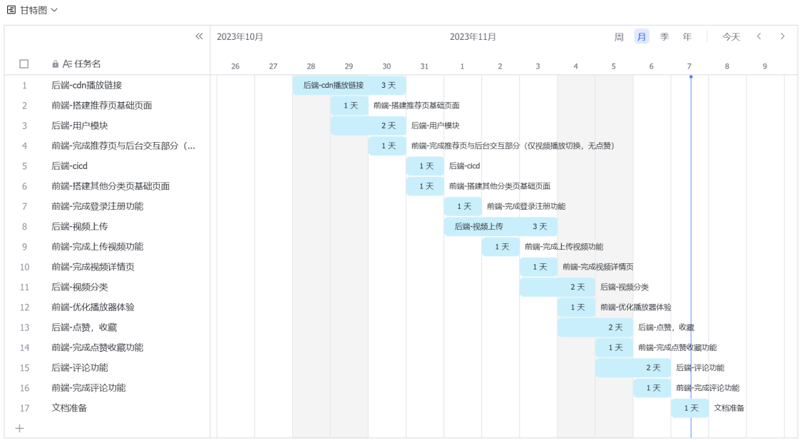
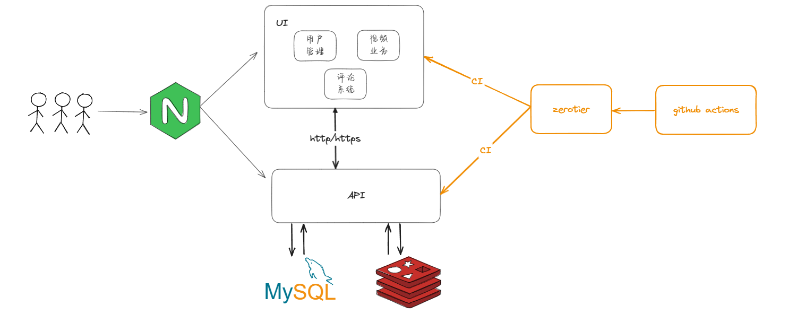
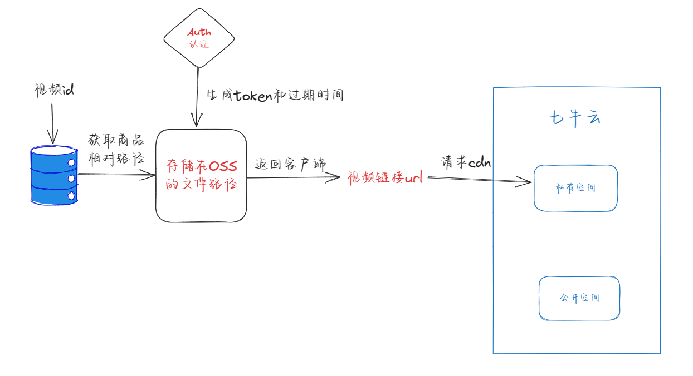

# 项目分工

| **团队成员** | **主要贡献**                                                 |
| :----------- | ------------------------------------------------------------ |
| 李梓扬       | 负责视频cdn播放链接，为前端提供尽量不重复且随机的视频url链接。 用户模块开发，提供登录注册等功能。 前后端cicd构建。 视频上传，视频分类，点赞、收藏、评论模块开发。 |
| 朱绍聪       | 负责前端项目的基础搭建，基本的utils，redux，路由的搭建封装。 推荐页、分类页、上传页与视频详情页开发。 登录注册模块开发、基于xgplayer的视频播放器封装、评论等公共组件的封装。 |

**甘特图：**

# 技术架构图

# 架构设计

## 登录注册

### 需求分析

用户界面提供登录和注册功能，服务端需记录用户的登录记录信息并返回用户凭证，后续可根据此凭证进行视频推送，用户上传视频等功能。

### 总体方案

前后端采用RSA加密，前端使用后端给的RSA公钥进行加密，服务端收到前端的密文后，进行RSA解密，再将得到的明文进行md5加密，如果是注册则将md5密文密码插入数据库，否则从数据库查出用户信息，比较密码是否相同，相同则认证成功。随后生成jwt令牌，将用户id记录入令牌并设置过期时间，将jwt返回前端，此后前端发送请求均会带上请求头 `Authorization: jwt` 以辨明身份

## 视频详情

### 需求分析

前端在首页展示用户推荐视频，用户可点击视频详情页进行查看，用户可以查看到视频的标题，内容，作者信息，点赞和收藏数等。

### 总体方案

推荐页由服务端获取一定的随机id列表后，使用洗牌算法进行打乱，选取部分返回给前端，剩余的存入redis供下一次请求使用。

获取某个视频的详情页则是根据视频id，请求服务端返回该视频的详情数据。

获取视频cdn播放链接的流程如下图所示

## 视频上传

### 需求分析

提供给用户上传视频的功能，并可在推荐或分区中查看到视频

### 总体方案

1. 由前端计算出上传文件的md5和文件后缀名，向服务端请求上传id
2. 服务端保存用户信息和其上传的文件对应的信息，并通过七牛云sdk初始化上传任务，返回上传id。
3. 前端通过请求到的上传id，切片总数量和当前上传的切片数量，向服务端上传文件切片。
4. 服务端通过七牛云sdk上传文件切片，并记录已上传的切片索引和七牛云返回的结果信息。
5. 整个文件上传完毕后，服务端通过七牛云sdk组装上传文件，与此同时会触发工作流，对上传的视频文件截取第一帧作为预览图，临时视频文件会存储在 `/temp/vidoes` ，临时预览图会存储在 `/temp/previews` 。
6. 用户通过前端填写完视频信息后，选择上传视频，服务端记录视频信息，并通过七牛云sdk将 `/temp/vidoes` 和  `/temp/previews` 中的对应文件移动至视频目录下。

## 视频点赞收藏

### 需求分析

用户可对视频进行点赞和收藏，对视频形成正反馈，收藏的视频可以让用户自己的收藏中快速找到。

### 总体方案

服务端使用redis set对用户点赞和收藏进行存储和去重，同时使用mq对数据进行异步落库

## 视频评论

### 需求分析

许用户在观看视频时发表评论、互动和分享观点。

### 总体方案

服务端采用mysql和redis对评论进行存储，mysql存储评论内容和具体的点赞信息，redis存储评论点赞数。

